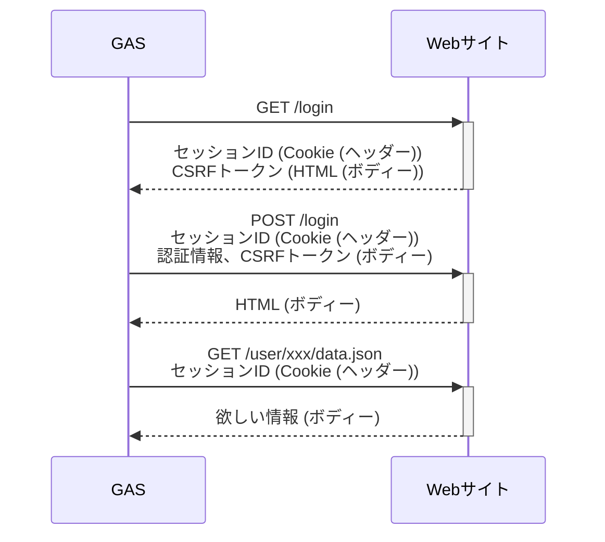

## まとめ

- スクレイピングの問題点やリスクを十分に認識し、利用する場面や実装内容を検討する必要がある
- HTTPリクエストの送信には、UrlFetchAppクラスを用いる
- HTTPレスポンスの解釈には、正規表現を用いるのが手
- 複雑な要件では、HTTPヘッダーの処理が必要

<!-- begin short upcoming concert announcement -->

> 私たちOrchestra Canvas Tokyoは、都内を中心に活動するアマチュア・オーケストラです。
>
> 次回は2025年7月にシューマンの交響曲第2番。
> 初めての方も、そうでない方も、お気軽にお越しください！
>
> 詳しくは[チケット販売ページ](https://teket.jp/1776/44429?uid=zenn)まで。

<!-- end short upcoming concert announcement -->

---

## 背景

当団（[Orchestra Canvas Tokyo](https://www.orch-canvas.tokyo/)）では、Google Apps Script(GAS)を用いて団内ツールを開発しています。

スクレイピングの簡単な自動化として、GASを用いる機会がありました。
それに向けた知見として、GASでスクレイピングを実装する際の知見についてまとめます。

## スクレイピングのリスク

スクレイピングは大きなリスクを孕む行為です。

利用規約にて明確に禁止されているサイトは少なくありません。
また、実装によっては相手方のサイトに大きな負担をかけてしまいます。

最悪の場合、**違法となりうる** 行為です。

今回の記事では詳しく触れませんが、規約の確認、設計の確認、リクエスト間隔の制御など、適切な前提のもと実装する必要があります。

## HTTPメッセージの解剖

これから記事中で頻出する単語について、その親子関係を整理します。

https://developer.mozilla.org/ja/docs/Web/HTTP/Guides/Messages

- HTTPメッセージ
  - リクエスト
    - メソッド e.g.) `GET`、`POST`
    - ヘッダー e.g.) `Content-Type: application/json`
    - ボディ
  - レスポンス
    - ステータス
    - ヘッダー
    - ボディ

冗長さ回避のため、各単語冒頭の「HTTP」を省略していますが、以降は適宜HTTP付きで表記していきます。

### クッキーの実体

クッキーは、特別なHTTPヘッダーとしてやり取りされています。

https://developer.mozilla.org/ja/docs/Web/HTTP/Guides/Cookies

要所をかいつまむと、次のようなやり取りになっています。

```plain
# HTTPレスポンス内のヘッダー
Set-Cookie: hoge=fuga
Set-Cookie: fuga=hoge

# HTTPリクエスト内のヘッダー
Cookie: hoge=fuga; fuga=hoge
```

GASでは、Cookieをよきに取り扱ってくれる組み込み関数はなさそうです。
HTTPヘッダーのやり取りとして、自力で記述する必要があります。

## スクレイピングの全体を俯瞰

スクレイピングで頻出かつ複雑なユースケースは、「認証付きページへのアクセス」でしょうか。
実装に主眼を置いた、認証付きページへのアクセス手順は次のようになります。



手順を分解して整理すると、次の要素で成り立っていることが分かります。

- HTTPリクエストの送信
  - GETリクエスト
  - POSTリクエスト
  - HTTPヘッダー付き（Cookie付き）リクエスト
- HTTPレスポンスの解釈
  - HTMLの解釈
  - 付与されたHTTPヘッダー（Cookie）の発見

これらいずれも、GASで問題なく実装できます。
順に述べていきます。

## HTTPリクエストの送信

UrlFetchAppクラスを用います。

https://developers.google.com/apps-script/reference/url-fetch/url-fetch-app?hl=ja

### GETリクエスト

最も基本的なリクエストです。
実装例を示します。

```js
// 固定URLへのリクエスト
const response1 = UrlFetchApp.fetch('https://example.com/');

// 動的なクエリパラメータを有する場合のリクエスト
const url = new URL('https://example.com/');
url.params.append('hoge', 'fuga');
const response2 = UrlFetchApp.fetch(url.toString()); // https://example.com/?hoge=fuga へリクエストされる
```

クエリパラメータの他でも、URL操作にはURLインターフェースを用いると便利です。

https://developer.mozilla.org/ja/docs/Web/API/URL

### POSTリクエスト

GETリクエストから、HTTPメソッドおよびHTTPボディーを指定する必要があります。

```js
// 固定URLへのリクエスト
const response1 = UrlFetchApp.fetch('https://example.com/', {
  method: 'post',
  payload: {
    'hoge': 'fuga'
  }
});

// JSONを用いる場合のリクエスト
const data = {
  'hoge': 'fuga'
}
const response2 = UrlFetchApp.fetch('https://example.com/', {
  method: 'post',
  contentType: 'application/json',
  payload: JSON.stringify(payload)
});
```

`payload`にJavaScriptオブジェクトを指定した場合、フォームデータとして扱われるようです。
`contentType`は自動的に`application/x-www-form-urlencoded`か`multipart/form-data`とされるようです[^1]。

[^1]: https://developers.google.com/apps-script/reference/url-fetch/url-fetch-app?hl=ja#fetchurl,-params

### HTTPヘッダー付き（Cookie付き）リクエスト

これまで示した例にある、`fetch()`関数の第2引数に指定します。

前述したように、Cookieの実体はHTTPヘッダーです。
Cookie付きリクエストも応用として記述できます。

```js
// 単純なHTTPヘッダー付きリクエスト
const response1 = UrlFetchApp.fetch('https://example.com/', {
  header: {
    'X-Hoge': 'fuga'
  }
});

// クッキー付きのリクエスト
const cookies = [
  'hoge=fuga',
  'fuga=hoge'
];
const cookieHeaderValue = cookies.join('; ')

// 「Cookie: hoge=fuga; fuga=hoge」ヘッダー付きでリクエストされる
const response2 = UrlFetchApp.fetch('https://example.com/', {
  header: {
    'Cookie': cookieHeaderValue
  }
});
```

## HTTPレスポンスの解釈

後半戦です。
この調整こそがスクレイピングの山場です！

### HTMLの解釈

大半のケースでは正規表現で十分でしょう。

https://developer.mozilla.org/ja/docs/Web/JavaScript/Guide/Regular_expressions

正規表現の実際は、それぞれのHTMLに大きく依存します。
ここでは、よく使うCSRFトークンを取得する例を示します。

実際には、テストツールを使って一意かつ再現性のある値が取得できるか、検証していくことになると思います。

https://regex101.com/

```js
const response = = UrlFetchApp.fetch('https://example.com/');
const body = response.getContentText();

// CSRFトークンを取得する
// e.g.) <input type="csrfToken">hoge</input>
//         -> csrfToken = hoge
const csrfToken = body.match(/<input.+name="csrfToken".*>(.+)</)[1];
```

より厳密に、あるいは可読性高く記述するために、HTMLの構文解釈を必要とするのであれば、XmlServiceクラスが有用かもしれません（未検証）。

https://developers.google.com/apps-script/reference/xml-service/xml-service?hl=ja

### 付与されたHTTPヘッダー（Cookie）の発見

`getAllHeaders()`メソッドを用いて記述します。

類似のメソッドとして`getHeaders()`がありますが、複数の値をもつのヘッダーをうまく取り扱うことができません。
Cookieの処理などで困ってしまいますので、シンプルなケースを除いては`getAllHeaders()`の利用が好ましいでしょう。

```js
const response = = UrlFetchApp.fetch('https://example.com/');
const headers = response.getAllHeaders();

// 単純なHTTPヘッダーの取得
const hoge = headers['hoge'];

// Cookieの取得
// e.g.) cookies = ['hoge=fuga', 'fuga=hoge']
const cookies = headers['Set-Cookie'];
```

---

## おわりに

最後までお読みいただきありがとうございました！

Webアプリを構成する技術、HTTPメッセージ、Cookie、セッション――
スクレイピングの設計・実装を通して、これらの解像度を上げることができ、気分が良いものです！

---

<!-- begin long upcoming concert announcement -->

## 次回演奏会のご案内

Orchestra Canvas Tokyoは、都内を中心に活動するアマチュアオーケストラです。

日々の癒しに、新たなひらめきのきっかけに——
オーケストラの演奏会はいかがでしょうか？

初めての方も大歓迎！
ご来場をお待ちしています。

> **Orchestra Canvas Tokyo**
> **第14回定期演奏会**
>
> 2025年7月12日(土)
> 練馬区立練馬文化センター 大ホール
> シューマン / 交響曲第2番 ほか
>
> [](https://www.orch-canvas.tokyo/concerts/regular-14)
>
> 詳細は[チケット販売ページ](https://teket.jp/1776/44429?uid=zenn)にて

<!-- end long upcoming concert announcement -->
